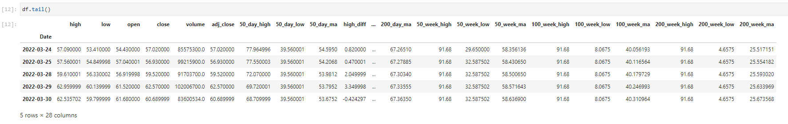

---
deeptendies
---

[](https://pypi.python.org/pypi/deeptendies)
[](https://travis-ci.com/stancsz/deeptendies)
[](https://deeptendies.readthedocs.io/en/latest/?version=latest)

Bringing quantitative trading to the masses!

The most difficult part of quantitative analysis is getting started. This project has you covered ;)

It is a one-stop shop for obtaining historical data, engineering features, and fitting the data through a pipeline.


# Features
Let's open a blank colab and try out this library: https://colab.research.google.com/#create=true

```python
# 1 Liner easy install
!pip install git+https://github.com/stancsz/deeptendies && pip install -r https://raw.githubusercontent.com/stancsz/deeptendies/main/requirements.txt
import deeptendies as dt

# Look and feel of pandas usage & get a pd.DataFrame
df = dt.DataFrame.from_yf('GME')
print(type(df))

# Builtin Pipeline class for mass features processing
pipeline = dt.Pipeline(
    [
        dt.Feature.get_x_high,
        dt.Feature.get_x_low,
        dt.Feature.get_x_ma,
        dt.Feature.get_diff
    ]
)
df = pipeline.run(df=df, x=50, interval='day')
df = pipeline.run(df=df, x=100, interval='day')
df = pipeline.run(df=df, x=200, interval='day')
df = pipeline.run(df=df, x=13, interval='week')
df = pipeline.run(df=df, x=26, interval='week')
df = pipeline.run(df=df, x=52, interval='week')
df[['50_day_ma','200_day_ma']].plot()
```
happy quanting :)

## Additional Features: Feature engineering
Easy to use feature engineering methods
```python
df = dt.Feature.get_x_low(df, x=52, interval='week')
df = get_x_ma(df, x=50, interval='day')
```
learn more @ `deeptendies/feature.py`


## Jupyter
[or use it in a notebook](https://github.com/deeptendies/deeptendies/blob/master/tests/jupyter/01_getting_stock_data_and_engineer_feature.ipynb)

# Development guide
```
git clone https://github.com/deeptendies/deeptendies.git
pip install -e deeptendies
```

# Credits
- This package is redesigned from the [legacy deeptendies package](https://github.com/deeptendies/legacy-deeptendies-library), credits to original authors.
  - @mklasby @bgulseren @KBehairy @hasnil @Karenzhang7717
- This package was created with Cookiecutter and the audreyr/cookiecutter-pypackage project template.

# License
- Free software: MIT license
- Documentation: <https://deeptendies.readthedocs.io>.
